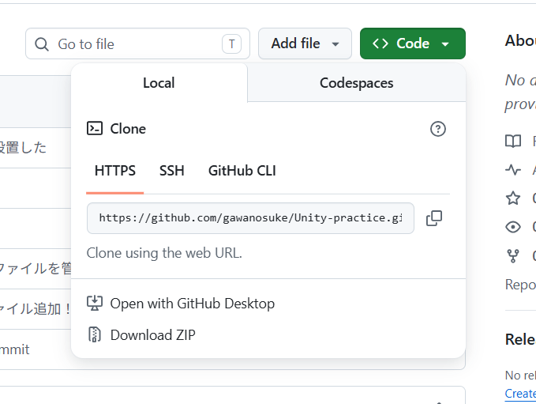

# Gitを用いたUnity共同開発用コマンドメモ
Unityの共同開発をするときに使用するGitのコマンドの一覧・手順です

## フォルダの移動(準備)
* `pwd` いま自分がどのフォルダにいるか確認する
* `ls` いまいるフォルダの中身を一覧で表示する
* `cd /c/Users/。。。` 指定したフォルダへ移動する（絶対パス）
* `cd ..`1つ上の階層のフォルダに戻る

## 最初のセットアップ
* `git clone <URL>` GitHubにあるプロジェクトを自分のPCにダウンロードする
  * `git init` 新しく GitHub に上げる場合は上記ではなくこのコマンド
 
 URLは右上の「<> Code ▼」ボタンから取得できる

## 毎日の開発の流れ
### 作業を始める前
* `git pull origin main` 他の人が作った最新の変更を、自分のPCに取り込む

**この後Unity HubからUnityを起動、開発をする**

### 作業が終わった後
* `git add .` 変更したファイルを、保存するリストに登録する（ステージング）
* `git commit -m "メッセージ"` 変更したファイルに「何を変えたか」のメモをつけて保存する
* `git push origin mai` 自分の変更をGitHub（サーバー）にアップロードして、みんなに共有する

これで終わりです

## 注意点
2人が同時に同じシーンやファイルを編集してpushすると、データが衝突して壊れてしまう

ルールをチームで決めておくことが大切
